% title: Statistical Modeling of Conformational Dynamics
% subtitle: Second Year Progress Report
% author: Robert McGibbon
% author: August 27, 2013
% thankyou: Questions?
% thankyou_details: Thanks especially to Vijay, Christian S., TJ L. and Kyle B.
% contact: www <a href="http://rmcgibbo.appspot.com/">website</a>
% contact: github <a href="https://github.com/rmcgibbo">rmcgibbo</a>
% favicon: http://www.stanford.edu/favicon.ico

---
title: Overview
dsubtitle: Three Parts

  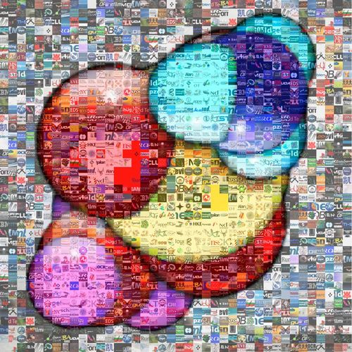
  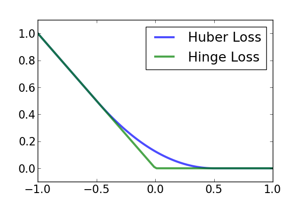
   
  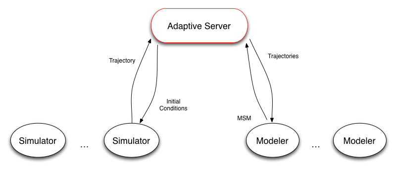

- Motivation
- Improving MSM construction with large-margin metric learning
- Current projects and future directions
    - Adaptive sampling
    - Statistical model selection
    - Richer model classes
    
---
title: Biology at the Atomic Length Scale

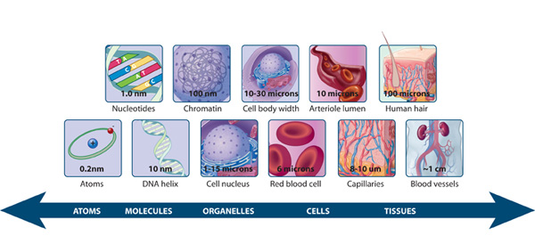

<footer class="source"> http://www.nature.com/scitable/topicpage/what-is-a-cell-14023083</footer>

---
title: Biology at the Atomic Length Scale

<table><tr>
  <td> 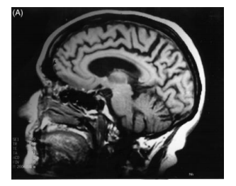 </td>
  <td> 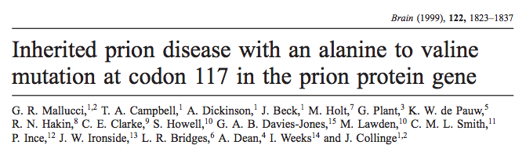 </td>
</tr></table>
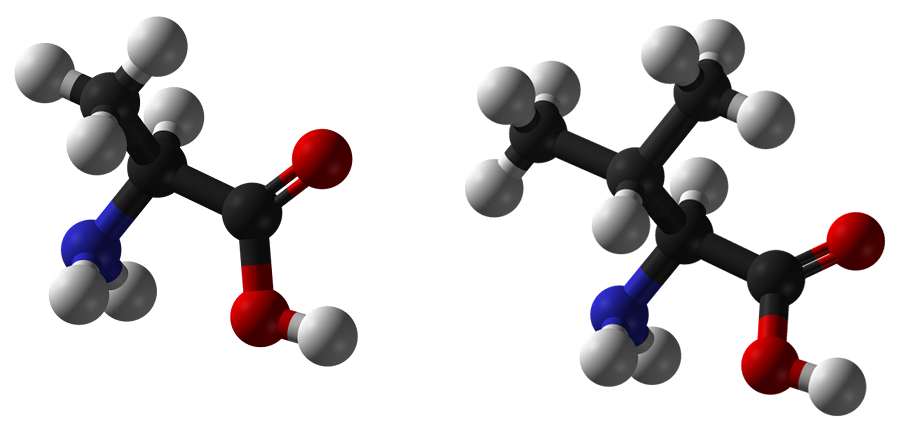

<footer class="source">
G.R Mallacci et. al., Brain 122, 1823 (1999).
</footer>

---
title: Molecular Dynamics

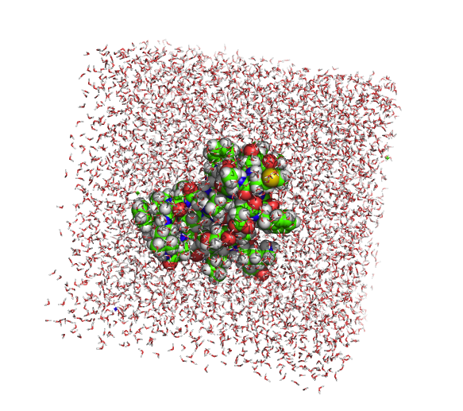

  

- Calculate the physical interactions in the system.
- Numerically integrate the equations of motion.

<footer class="source">
W. D. Cornell et. al., J. Am. Chem. Soc. 117, 5179 (1995).
</footer>

---
title: MD Datasets are Large
subtitle: First world problems

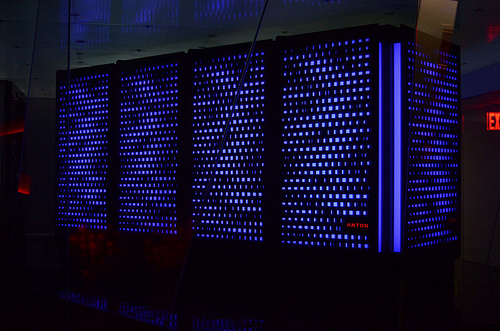

- $100 \frac{\text{ns}}{\text{day } \cdot \text{ GPU}} \cdot 500 \text{ GPUs} \cdot 1 \text{ week} = 350 \text{ $\mu$s}$
- Storing the positions every 200 ps, this is a $\sim$ 1 TB dataset.

---
title: Predictive and interpretable models from atomic-level simulations
build_lists: true

- What are the relevant conformational states?
- What are the characteristic dynamics between them?

- States are a Voronoi tessellation of conformation space $$s_i = \lbrace x \in \Omega : d(x, y_i) \lt d(x, y_j) \;\forall\; j \in S, j \neq i \rbrace $$
- Dynamics are Markovian through state space $$P(s_t | s_{t-1}, s_{t-2}, \ldots) = P(s_t | s_{t-1})$$

---
title: Improving Markov State Model Construction
subtitle: "Learning Kinetic Distance Metrics", JCTC (2013)
class: segue dark nobackground

---
title: MSMs have Competing Sources of Error

The MSM state decomposition, a *clustering*, is characterized by a bias-variance trade off.

- **Bias:** Lowering the number of states introduces systematic error in the model's dynamics.
- Hamiltonian mechanics is perfectly Markovian in $\mathbb{R}^{6N}$
- **Variance:** Raising the number of states increases statistical noise in the model's dynamics.
- How do we balance this trade off and avoid overfitting?

---
title: Choosing the States' Shape

- Conformational change is characterized by slow *conformationally subtle*
  transitions.
- To resolve these transitions in our models, our states need to be "smaller".
- We can save our statistics by picking their **shape** more intelligently.

---
title: Large-Margin Classification

- Goal of the distance metric for clustering is to distinguish *kinetically*-close
  from *kinetically*-far pairs of conformations. 
- Large-margin learning theory: reduce generalization error by separating the
  two classes as far as possible.

$$ \max_{\mathbf{X},\rho} \left[ \alpha \rho - \frac{1}{N} \sum_i^N \lambda_\text{huber} \left(d^\mathbf{X}(\vec{a}_i,\vec{c}_i) - d^\mathbf{X}(\vec{a}_i, \vec{b}_i) - \rho \right) \right] $$

---
title: Optimization and Constraints

$$ d^{\mathbf{X}}(\vec{a}, \vec{b}) = (\vec{a} - \vec{b})^{T} \mathbf{X} (\vec{a} - \vec{b}) $$

$$ \max_{\mathbf{X},\rho} \left[ \alpha \rho - \frac{1}{N} \sum_i^N \lambda \left(d^\mathbf{X}(\vec{a}_i,\vec{c}_i) - d^\mathbf{X}(\vec{a}_i, \vec{b}_i) - \rho \right) \right] $$

- The matrix $\mathbf{X}$ is constrained to be positive semidefinite.
- Relatively efficient optimization by gradient descent with rank-1 updates naturally maintains p.s.d. constraint.

<footer class="source">Shen, C.; Kim, J.; Wang, L. Scalable large-margin Mahalanobis distance metric learning. IEEE Trans. Neural Networks 2010, 21, 1524–1530</footer>

---
title: KDML Model System
class: img-top-center

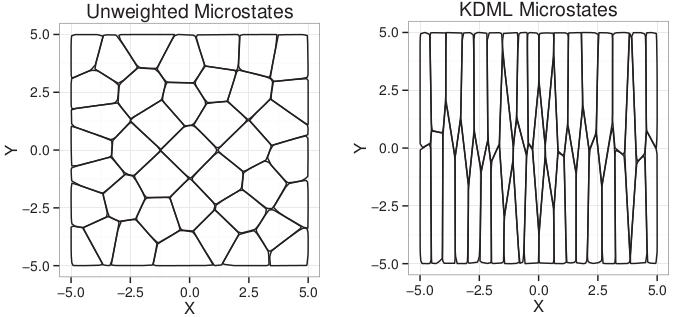

2D Brownian dynamics, where vertical diffusion constant is 10x greater than the horizontal diffusion constant.

<footer class="source">McGibbon, R. T.; Pande, V. S.; J. Chem. Theory Comput., 9 2900 (2013) 10.1021/ct400132h </footer>

---
title: KDML Model System
class: img-top-center

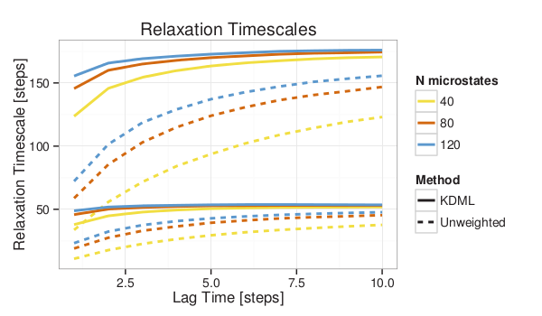

KDML distance metric gives converged behavior with fewer states.

<footer class="source">McGibbon, R. T.; Pande, V. S.; J. Chem. Theory Comput., 9 2900 (2013) 10.1021/ct400132h </footer>

---
title: Fip35 WW Domain

<table><tr>
<td></td>
<td>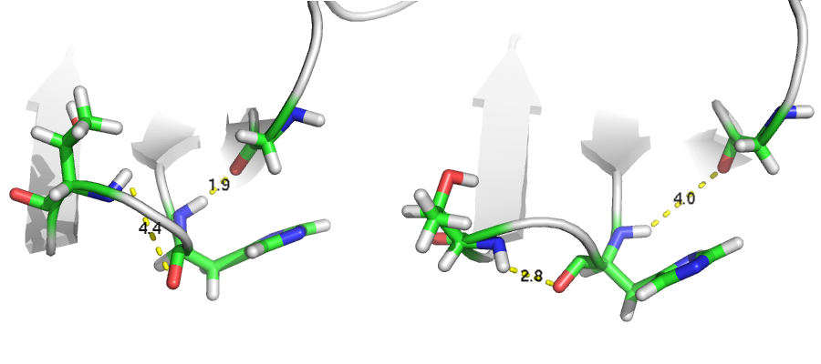</td>
</tr></table>

- The folding timescale is remarkably robust to changes in the distance metric.
- New timescales are observed in the 100 ns - 1 μs regime, corresponding to near-native hydrogen bond reorganizations in the turns.

---
title: Future Directions
subtitle: Adaptive sampling, model selection, statistical learning.
class: segue dark nobackground

---
title: Current projects
subtitle: MSM-accelerated Distributed Molecular Dynamics

<table>
<tr><td> 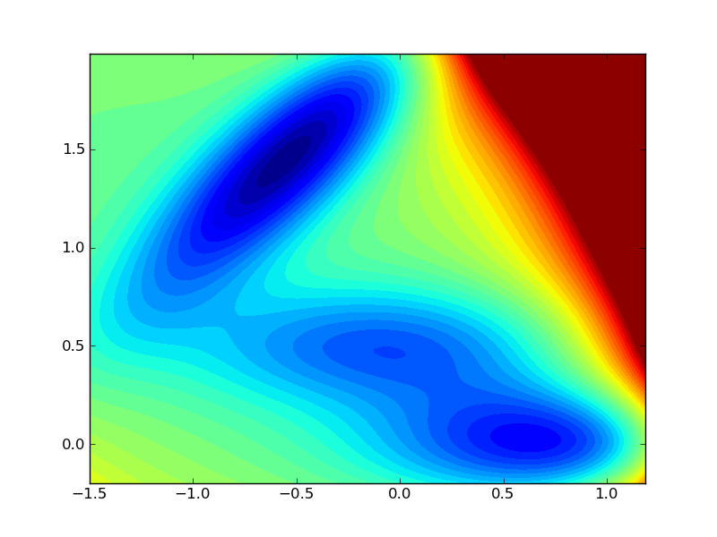 </td></tr>
<tr><td> 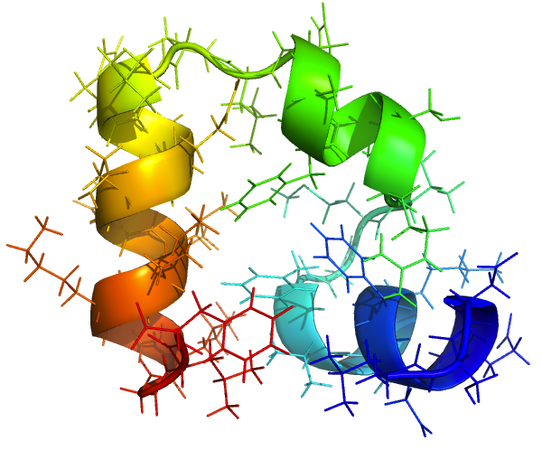 </td></tr>
<tr><td> 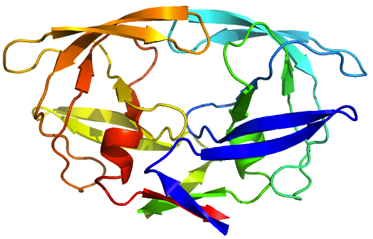 </td></tr>
</table>

- Node-parallelism is the present and future of computing. We must exploit ergodic theorem.
- MSMAccelerator: cluster based client-server architecture over ZeroMQ. 
- Runs simulations with OpenMM & AMBER.
- Starting conditions determined on-the-fly by MSMBuilder.

<footer class="source">McGibbon, R.T.; Kiss, G.; Harrigan, M. P; Pande, V. S., <i>in preparation</i></footer>

---
title: Current Projects
subtitle: Hierarchical Bayesian Mutant Sampling

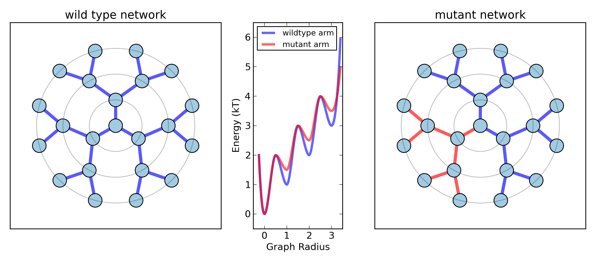 
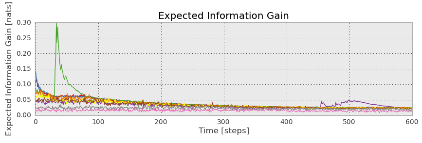 

- Informative prior on the mutant based on simulations of the wild-type
$$\vec{p}_i^{M} \sim \operatorname{Dir}(q_i \cdot \vec{c}_i^{WT} + 1/2) $$
- Where $q_i$ models info. transfer between wild-type and mutant states $i$
  with hyperprior: $q_i \sim \text{Beta}(\alpha, \beta)$
- Per-state expected information gain is semi-analytically solvable.

<footer class="source">McGibbon, R.T.; Pande, V. S., <i>in preparation</i></footer>

---
title: Current Projects
subtitle: Optimal MSM Model Selection

- Chapman–Kolmogorov tests cannot be used as an objective function.

$$ T(n \cdot \tau) = T(\tau)^n $$

- Likelihood function *opens a door*.
    - BIC, Cross validation
    

$$ P(\text{traj} \;|\; \text{MSM}) = \prod_{i=1}^{N} \overbrace{p(x_i | s_i)}^\text{tricky part} \cdot T_{s_{i-1} \rightarrow s_i}  $$

<footer class="source">Schwantes, C.R.*; McGibbon, R.T.*; Pande, V.S., <i>in preparation</i></footer>

---
title: New Idea
subtitle: Markov-switching Autoregressive Model

- MSM description of within-state dynamics as i.i.d. samples pushes lagtime out, lowers temporal resolution.
- Hybrid model: dynamics are an Ornstein–Uhlenbeck process, but $\mu, \Sigma, \gamma$
  evolve by latent discrete-state Markov jump process.

$$ P(s_t = j| s_{t-1} = i) = T_{ij} $$

$$ X_{t} = \boldsymbol{A_{s_t}} (X_{t-1}-\mu_{s_t}) + \mathcal{N}(\mu_{s_t}, \boldsymbol{\Sigma}_{s_t}) $$

<aside class="note">
a,b,c
</aside>

<footer class="source">
Hamilton, J. D. <i>Econometrica</i> 57 (1989): 357-384.  
Hamilton, J. D. <i>J. Econometrics</i> 45 (1990): 39-70.
</footer>

---
title: New Idea
subtitle: Markov-switching Autoregressive Model

<video width="500" height="500" controls>
  <source src="videos/MSARMvsHMM.mp4" type="video/mp4">
  <source src="videos/MSARMvsHMM.ogg" type="video/ogg">
Your browser does not support the video tag.
</video>

Realizations from MSArM and (Gaussian) MSM

- Same transition matrix.
- Same within-state equilibrium distributions.
- Which looks more like conformational dynamics?

